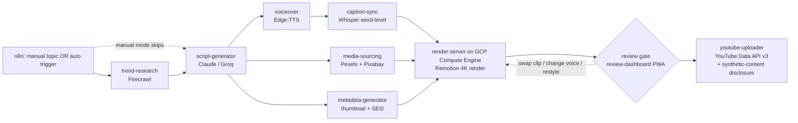

# AI News YouTube Automation

A production pipeline that researches, writes, voices, edits, and publishes English-language, European-audience news videos to YouTube — end to end, with a human still able to intervene at every step.

Two modes:
- **Manual** — you supply a topic, the system produces the full video.
- **Auto** — the system finds a trending, brand-safe news topic on its own and produces the video.

Every video: 5–20 minutes, broadcast-style (transitions, motion graphics, dramatic music/SFX, natural neural voiceover, word-synced highlighted captions, scrolling news ticker), rendered in 4K, with an auto-generated thumbnail, SEO title/description/tags/hashtags/chapters, uploaded via the YouTube Data API v3. Only copyright-safe stock media is used.

The pipeline does **not** auto-publish. After rendering, every video parks at a **human review gate** — a local, installable review dashboard where you watch it scene-by-scene and can swap a clip, change the voice, or restyle the on-screen text before approving. Approval is what releases the upload. See [`docs/REVIEW-DASHBOARD.md`](docs/REVIEW-DASHBOARD.md).

Because every video uses a synthetic voice and an AI-written script, the uploader always sets YouTube's **"altered or synthetic content"** disclosure, and the script generator adds an **original-insight layer** (context, analysis, implications) to every segment rather than reading headlines verbatim — both required to stay monetizable under YouTube's 2026 inauthentic-content policy.

For the same reason, videos don't share one look: an **18-theme design system** (palette, font pairing, ticker, lower-third, transitions, motion graphics) auto-rotates so consecutive uploads aren't the same template re-run, with a manual override in the review dashboard. See [`docs/PIPELINE.md`](docs/PIPELINE.md#theme-selection).

## Why this architecture

The pipeline is split into small, single-purpose services connected by a **shared job artifact store** (Cloudflare R2, S3-compatible) rather than one monolithic script, because:

1. **GitHub Actions runners are stateless and ephemeral.** Nothing survives between steps except what you explicitly persist — so every step reads its inputs from and writes its outputs to `jobs/{jobId}/...` in R2. This also means any failed step can be re-run in isolation without re-running the whole pipeline (see [`docs/PIPELINE.md`](docs/PIPELINE.md)).
2. **Rendering is the one step that doesn't fit GitHub Actions.** A 4K, 5–20 minute Remotion render is CPU/memory-heavy and can exceed free-tier job limits. So rendering runs on a **Google Compute Engine VM** (`c2-standard-8`, funded by Google for Startups credit) instead — started on demand per job and self-stopped when done, via a lightweight `render-server` that GitHub Actions triggers once every upstream artifact is ready.
3. **n8n orchestrates, it doesn't do the heavy lifting.** n8n's job is sequencing, retries, and (optionally) pausing for human review — e.g. approving a script or thumbnail before render. The actual work (LLM calls, TTS, Whisper, ffmpeg, Remotion) lives in versioned, independently testable code under `services/` and `remotion/`, which also run in CI.
4. **Every inter-step contract is a typed schema**, not "whatever JSON happened to come out." `services/shared/schemas` (Zod, mirrored as `pydantic` models in the Python services) is the single source of truth for `trend.json`, `script.json`, `captions.json`, etc. — this is what keeps 8 independently-deployable steps from silently drifting apart.

## Pipeline overview



The `review gate` is a human approval step: the rendered video parks there until you approve it, and from it you can trigger targeted re-renders (clip swap), a voice change, or a restyle — which loop back through the renderer. Nothing uploads without approval.

Full data contract and step-by-step artifact list: [`docs/PIPELINE.md`](docs/PIPELINE.md).

## Repo layout

```
.github/workflows/    GitHub Actions — one workflow per pipeline step (light tasks, free tier)
n8n/workflows/         Exported n8n workflow JSON (manual mode, auto mode, error handling)
services/              One folder per pipeline step (see docs/PIPELINE.md for I/O contracts)
  trend-research/         Firecrawl-based trending news discovery         (Node/TS)
  script-generator/       Claude API / Groq script writing                (Node/TS)
  voiceover/              Edge-TTS narration                              (Python)
  caption-sync/           Whisper word-level caption timestamps           (Python)
  media-sourcing/         Pexels + Pixabay stock footage/music/SFX        (Node/TS)
  metadata-generator/     Thumbnail + SEO title/description/tags/chapters (Node/TS)
  youtube-uploader/       YouTube Data API v3 upload                      (Node/TS)
  shared/                 Job-store client, logger, Zod schemas
remotion/               The render pipeline: compositions, captions, ticker, transitions, motion graphics
apps/
  review-dashboard/       Human review + approval gate — installable PWA + Fastify API (docs/REVIEW-DASHBOARD.md)
infra/
  gcp/                    Terraform + VM bootstrap for the on-demand render VM
  render-server/          Receives render jobs, runs Remotion, pushes the result back to R2
  docker/                 Render environment Dockerfile
config/                 Per-niche config (voice, tone, safety rules, video length bounds)
assets/                 Fonts, branding, motion graphics templates
docs/                   Architecture, setup, and pipeline documentation
```

## Tech stack

| Concern | Choice | Why |
|---|---|---|
| Orchestration | n8n | Visual sequencing + retries + human-in-the-loop, without hand-rolling a state machine |
| Review + approval gate | Local PWA (installable) + Fastify | Scene-by-scene review, clip/voice/style edits, and the approve step that gates upload — runs on localhost, hostable on Cloudflare Pages later |
| Trending research | Firecrawl | Structured extraction from news sources, not just raw search snippets |
| Script | Claude API, Groq (`llama-3.3-70b`) fallback | Quality primary, fast/cheap fallback for resilience |
| Voiceover | Edge-TTS | Free, natural neural voices, no per-character billing |
| Captions | Whisper (word-level timestamps) | Only practical way to get accurate word-sync highlighting |
| Stock media | Pexels + Pixabay | Both license free commercial use without attribution — nothing else is used |
| Rendering | Remotion, server-side via `@remotion/renderer` | React-based compositions, frame-accurate, scriptable — not a browser-canvas hack |
| Music/SFX | Pixabay Audio / YouTube Audio Library | Same copyright-safety guarantee as stock footage |
| Upload | YouTube Data API v3 | Official, quota-metered, supports scheduled publish |
| Light compute | GitHub Actions | Free tier covers research/script/TTS/captions/metadata comfortably |
| Heavy compute | Google Compute Engine (`c2-standard-8`, on-demand) | Funded by Google for Startups credit; started per job and self-stopped to make the credit last, since neither Oracle's (recently halved) free tier nor GCP's own free `e2-micro` have enough headroom for 4K Remotion rendering |
| Job artifact storage | Cloudflare R2 | S3-compatible, free tier, is what makes stateless GH Actions steps possible |

## Setup

See [`docs/SETUP.md`](docs/SETUP.md) for the full account/API-key checklist and install steps.

## Status

Repo scaffold — most services are stubbed with README contracts and GitHub Actions skeletons. The **Remotion render pipeline is implemented and verified end-to-end** (`remotion/`, `infra/render-server/`, `services/shared/`): `.smoke-test/` drives the real download → render → upload path against an in-process S3-compatible store (s3rver) standing in for R2.

Build order: **Remotion render pipeline first** (done), since every other step's output format is designed around what the renderer needs to consume. Then the remaining services, the **review-dashboard** (`apps/review-dashboard/`), and the two compliance requirements baked into their contracts — the script generator's original-insight layer and the uploader's synthetic-content disclosure.
